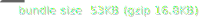

# OGGEH Web Component

[](https://opensource.org/licenses/MIT) 

This is a free [Web Component](https://developer.mozilla.org/en-US/docs/Web/API/Web_components) that introduces our custom element `<oggeh-content></oggeh-content>` for automating our Content Delivery API. Perfect for skills limited to HTML only.

> You need a Developer Account to obtain your App API Keys, if you don't have an account, [create](https://account.oggeh.com/request) one now.

## Getting Started

1. First, you need to configure your App API Key at the end of the `<head>` tag:
```html
<script>
  window.oggeh = window.oggeh || {
    api_key: "YOUR_OGGEH_APP_API_KEY", // Required
    // api_secret: "YOUR_OGGEH_APP_API_SECRET", // Use only in mobile/desktop/nodejs apps
    // sandbox_key: "YOUR_OGGEH_APP_SANDBOX_KEY", // Use only in a development environment
    // domain: "YOUR_OGGEH_HOSTNAME", // Use only in mobile/desktop/nodejs apps
  };
</script>
```
2. Next, you need to install our web component after the above script, also at the `<head>` tag:
```html
<script src="https://unpkg.com/@oggeh/web-component/dist/oggeh.min.js"></script>
```
3. Finally, use the custom element for loading your dynamic content anywhere at the `<body>` tag. Example navigation tag:
```html
<oggeh-content get="app" render="nav">
  <!-- Template for a leaf navigation item (a single link in a list item) -->
  <template id="oggeh-nav-leaf">
    <li>
      <a href="/page/key={{ key }}">{{ subject }}</a>
    </li>
  </template>
  <!-- Template for a branch navigation item (with nested children) -->
  <template id="oggeh-nav-branch">
    <li class="dropdown">
      <a href="/page/key={{ key }}">{{ subject }}</a>
      <ul>
        <!-- This slot is where child navigation items (leaf or branch) will be inserted -->
        <slot></slot>
      </ul>
    </li>
  </template>
  <!-- Template for the overall navigation container -->
  <template id="oggeh-nav">
    <div class="navbar-collapse collapse clearfix">
      <ul class="navigation">
        <!-- All navigation items will be slotted into this list -->
        <slot></slot>
        <!-- Predefined routes -->
        <li>
          <a href="/news">News</a>
        </li>
        <li>
          <a href="/contact">Contact</a>
        </li>
      </ul>
    </div>
  </template>
</oggeh-content>
```

## Supported Properties

1. `config`: Accepts one of the following values:

  | Value | Required Propetries | Description | Example |
  | --- | --- | --- | --- |
  | `anti-flicker` | | Hides page until all content is loaded | `<oggeh-content config="anti-flicket"></oggeh-content>` |
  | `router` | | Enforcing history state (_SPA mode_) | `<oggeh-content config="router"></oggeh-content>` |
  | `scripts` | `type="text/oggeh-defer"` | Defer template javascript after loading all content | `<oggeh-content config="scripts"></oggeh-content>` |
2. `get` (_required_): Accepts one of the following values:

  | Value | Required Propetries | Optional Propetries | Example |
  | --- | --- | --- | --- |
  | `app` | `render` (_options: `meta`, `nav`, `slider`, `locations`, `contact`, `social`_ ) | | `<oggeh-content get="app" render="nav"></oggeh-content>` |
  | `model` | | `start-key` | `<oggeh-content get="mode" start-key=""></oggeh-content>` |
  | `pages` | | `start-key` | `<oggeh-content get="pages" start-key="" limit=""></oggeh-content>` |
  | `page` | | `key`| `<oggeh-content get="page" key=""></oggeh-content>` |
  | `page-related` | | `key`, `model` (options: `*`, `product`, `event`, or a custom model key) | `<oggeh-content get="page-related" key="" model=""></oggeh-content>` |
  | `search-results` | `keyword` | | `<oggeh-content get="search-results" keyword=""></oggeh-content>` |
  | `news` | | `start-date`, `limit` | `<oggeh-content get="news" start-date="" limit="4"></oggeh-content>` |
  | `news-article` | `timestamp` | | `<oggeh-content get="news-article" timestamp=""></oggeh-content>` |
  | `news-related` | | `timestamp`, `limit` | `<oggeh-content get="news-related" timestamp=""></oggeh-content>` |
3. `custom`: Accepts a custom method defined at the global `oggeh` object (_see [Custom Methods](https://github.com/oggeh-dev/web-component/wiki/CustomMethods)_).

## Supported Templates

1. `oggeh-container` (_required_): A template for the loaded content inside our custom element.
2. `oggeh-repeat`: A template for repeated parts of the content, works when using a `<slot>` tag inside `oggeh-container`. Example:
```html
<oggeh-content get="app" render="social">
  <template id="oggeh-container">
    <ul class="footer-social-links">
      <slot></slot>
    </ul>
  </template>

  <template id="oggeh-repeat">
    <li>
      <a href="{{ url }}">
        <i aria-hidden="true" class="fa fa-{{ provider }}"></i>
      </a>
    </li>
  </template>
</oggeh-content>
```
3. Page blocks templates also available (_[learn more](https://github.com/oggeh-dev/web-component/wiki/Templates)_).

### Notes:

1. All templates accept placeholder tokens inside double-curly braces. Example: `{{ subject }}`
2. Nested properties can be chained using dot `.` Example: `{{ conver.regular.url }}`

## Supported Modifiers

| Modifier | Description | Example |
| --- | --- | --- |
| `is` | Decides to display token value if it exists or is empty | `{{ fax | is(fax) }}` |
| `fallback` | Decides to display an alternative value if the token does not exist or is empty | `{{ cover.maximum.url | fallback('data:image/gif;base64,R0lGODlhAQABAIAAAAAAAP///ywAAAAAAQABAAACAUwAOw==') }}` |
| `join` | Concatenates token list using the provided separator | `{{ tags | join(', ') }}` |
| `formatDate` | Displays unix timestamp in the following format `MMM DD, YYYY` | `{{ timestamp | formatDate }}` |
| `formatTime` | Displays unix timestamp in the following format `HH:MM:SS AM/PM` | `{{ timestamp | formatTime }}` |

## Supported Events

| Event | Description | Example |
| --- | --- | --- |
| `oggeh.ready` | Triggers when a single tag is done with loading content | `document.addEventListener('oggeh.ready', console.log)` |
| `oggeh.navigate` | Triggers when history state changes (_SPA mode_) | `document.addEventListener('oggeh.navigate', console.log)` |
| `oggeh.error` | Triggers when a single tag fails to load content | `document.addEventListener('oggeh.error', console.log)` |

### Example

```html
<!DOCTYPE html>
<html lang="en">
  <head>
    <meta charset="UTF-8" />
    <meta http-equiv="X-UA-Compatible" content="IE=edge" />
    <meta name="viewport" content="width=device-width, initial-scale=1.0" />
    <title>OGGEH Demo</title>

    <!-- Begin of OGGEH Web Component -->
    <script>
      window.oggeh = window.oggeh || {
        api_key: "YOUR_OGGEH_APP_API_KEY", // Required
        // api_secret: "YOUR_OGGEH_APP_API_SECRET", // Use only in mobile/desktop/nodejs apps
        // sandbox_key: "YOUR_OGGEH_APP_SANDBOX_KEY", // Use only in development environment
        // domain: "YOUR_OGGEH_HOSTNAME", // Use only in mobile/desktop/nodejs apps
      };
      document.addEventListener('oggeh.error', (event) => {
        console.error('OGGEH Error:', event.detail.error);
      });
      document.addEventListener('oggeh.ready', (event) => {
        console.log('OGGEH Response:', event.detail.data);
      });
      document.addEventListener('oggeh.navigate', (event) => {
        console.log('OGGEH Navigate:', event.detail.path);
      });
    </script>
    <script src="https://unpkg.com/@oggeh/web-component/dist/oggeh.min.js"></script>
    <!-- End of OGGEH Web Component -->

  </head>
  <body>

    <oggeh-content config="anti-flicker"></oggeh-content>
    <oggeh-content config="router"></oggeh-content>

    <oggeh-content get="app" render="nav">
      <!-- Template for a leaf navigation item (a single link in a list item) -->
      <template id="oggeh-nav-leaf">
        <li>
          <a href="/page/key={{ key }}">{{ subject }}</a>
        </li>
      </template>
      <!-- Template for a branch navigation item (with nested children) -->
      <template id="oggeh-nav-branch">
        <li class="dropdown">
          <a href="/page/key={{ key }}">{{ subject }}</a>
          <ul>
            <!-- This slot is where child navigation items (leaf or branch) will be inserted -->
            <slot></slot>
          </ul>
        </li>
      </template>
      <!-- Template for the overall navigation container -->
      <template id="oggeh-nav">
        <div class="navbar-collapse collapse clearfix">
          <ul class="navigation">
            <!-- All navigation items will be slotted into this list -->
            <slot></slot>
            <!-- Predefined routes -->
            <li>
              <a href="/news">News</a>
            </li>
            <li>
              <a href="/contact">Contact</a>
            </li>
          </ul>
        </div>
      </template>
    </oggeh-content>

    <oggeh-content config="scripts">
      <script type="text/oggeh-defer" src="/js/script.js"></script>
    </oggeh-content>

  </body>
</html>
```

## API Documentation

See [API Reference](https://docs.oggeh.com/#reference-section) for additional details on available values for _select_ attribute on each API Method.

## Credits

Copyright(c) 2025 OGGEH, Inc
